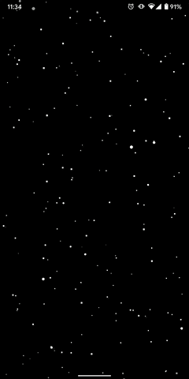

# 🤹 Compose Playground

This repo will be a collection of my experiments with some unique features and capabilities of Jetpack Compose

## 🔬 Experiments

#### All these experiments appear best when your device is in dark theme

### 1. 🌌 Night Sky

Dark sky with twinkling stars

### 2. 〰️ Sine waves

Colourful sine wave pattern

#### Credits: Dave ([beesandbombs](https://twitter.com/beesandbombs/status/1396614515228282883) on twitter)

## 🚀 Building

### You must have the latest Android Studio Preview (Canary channel)
1. Clone project
2. Run as usual
3. Profit
